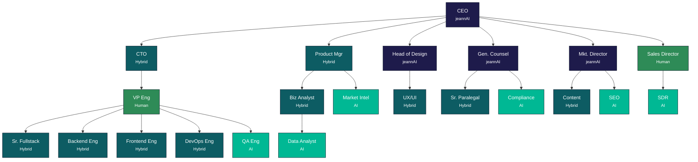

  

<h3 align="center">Where Data Converges</h3>

NexFolia is a financial data infrastructure company that helps fund administrators and asset managers modernize their ETL pipelines. Our platform, adAPPter, connects disparate data sources — from Bloomberg to internal systems — into a unified, auditable data flow. We blend deep IT expertise with financial domain knowledge to deliver solutions that institutional clients can trust.

<em>A <strong>jeannAI</strong> company</em>

---

## Organizational Structure

NexFolia operates as an **AI-native organization** — an 18-role NexFolia structure (22 nodes incl. holding context) where humans, hybrid human+AI roles, and autonomous AI agents work together under clear accountability frameworks.

> **[Open interactive org chart](https://nexfolia.github.io/.github/organigram.html)** — zoomable, expandable D3 visualization with agent details

**Legend:** Human (2) · Hybrid (10) · AI (6) · Holding (4) · **22 nodes**

---

  <strong>NexFolia</strong> — Precision. Convergence. Transparency. Evolution.

